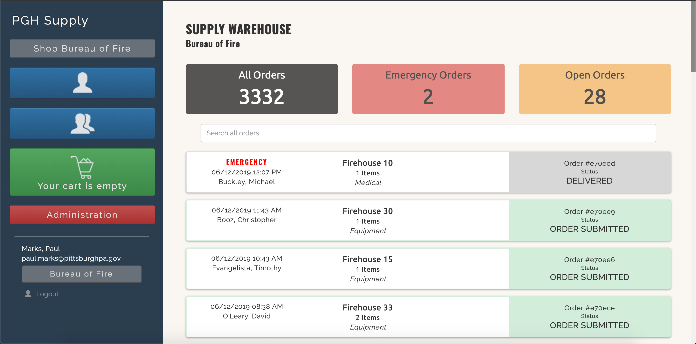

# PGH Supply

PGH Supply is a resupply portal used by the Bureau of Fire, and the Department of Public Works at the City of Pittsburgh.  PGH Supply serves as an e-commerce "wrapper" on top of the asset and inventory management system used at the City, [Cartegraph](https://www.cartegraph.com/).  Orders are placed for various fire houses or DPW divisions, and fulfilled by the respective supply warehouse.  PGH Supply provides a cart functionality that persists across sessions, and the ability to track open orders and order history.  Further, for transparency sake, and to prohibit duplicate orders, all orders are visible to all users within the site.

For available inventory items, PGH Supply interfaces with Cartegraph via the [cart-api](https://github.com/CityofPittsburgh/cart-api).  All order data and user profile data lives in MongoDB, and is accessed via the [mongo-proxy](https://github.com/CityofPittsburgh/mongo).  The administrator user group is defined in Sharepoint, and called upon via the [365-proxy](https://github.com/CityofPittsburgh/365-api).  Errors occuring within the client application are caught and reported to the [client-errors](https://github.com/CityofPittsburgh/client-errors) service.  All emails, such as for equipment repair requests, are delivered through Sendgrid via the [sendgrid-proxy](https://github.com/CityofPittsburgh/sendgrid-proxy).



## A note on boilerplate

The bones of PGH Supply are shared across all client applications developed by Paul Marks for the City of Pittsburgh.  For more in-depth documentation on the structure,  design choices, authentication flow, and installation procedures for this application, please see the documentation for the [boilerplate](https://github.com/CityofPittsburgh/react-typescript-boilerplate).

This README will focus only on the components of this application that are unique to PGH Supply.

## Structure
    ...
    app
    ├── src                         
        ├── components        
            |── addToCart              # Add items to cart
            |── admin                  # Admin wrapper for order view
            |── cart                   # Full cart, and nav cart part
            |── equipmentRepair        # Equipment repair form, PBF
            |── items                  # Lists of inventory items
            |── miscItem               # Submit an order for item not in inventory, PBF
            |── orders                 # Order lists -- all orders, and my orders
            |── printView              # Print view of order...because old people
            |── userProfile            # Sets and displays the user's profile, ie. department      
        ├── store                   
            |── deliveryLocations      # Collection of delivery locations, PBF and DPW
            |── items                  # Inventory items, PBF and DPW
            |── orders                 # All orders, PBF and DPW
            |── userProfile            # Logged in user's profile,  ie. department  

## Running Locally

### Prerequisites

* [Node.js](https://nodejs.org) - JS runtime
* .env - See .env.example for all required secrets

### Installation
```
git clone https://github.com/CityofPittsburgh/pgh-supply
cd pgh-supply
// first, install dependencies for the server
npm install
// then, install dependencies for the client
cd app
npm install
// to run the app locally and bypass auth
npm start
// to bundle the app for deployment
npm run build
// to run the app from the minified build, with auth workflow
cd ..
node server.js
```

## Deployment

Both staging and production services are hosted in Azure.  Application is deployed directly from github, and can be triggered either (a) through the Azure GUI, (b) through the [CLI](https://docs.microsoft.com/en-us/cli/azure/webapp/deployment/source?view=azure-cli-latest#az-webapp-deployment-source-sync), or (c) through the [proxy service](https://github.com/CityofPittsburgh/azure-proxy).

For complete documentation on the azure environment, see [here](https://github.com/CityofPittsburgh/all-things-azure.git).

## License

This project is licensed under the MIT License - see the [LICENSE.md](LICENSE.md) file for details